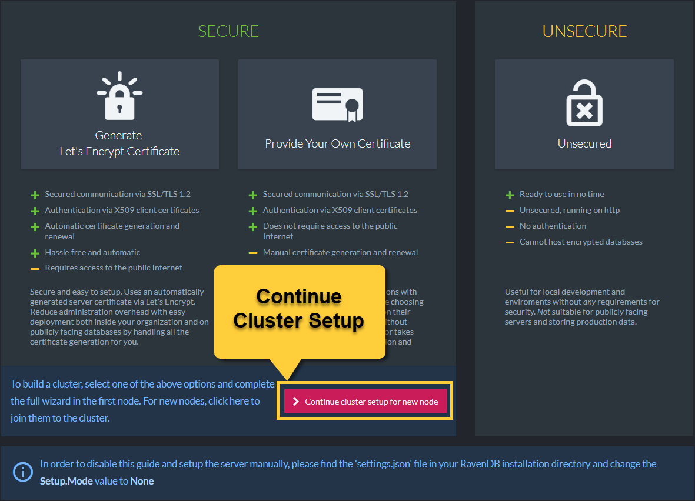
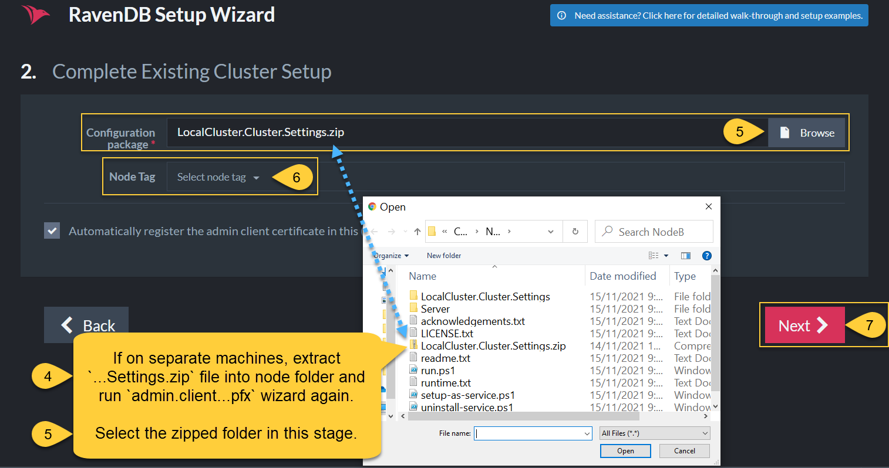

# Project

## Run raven

Run [this script](./run-linux.ps1) to start raven:
```
 .\run-linux.ps1
```

It will get the latest version of the RavenDB container from the Docker Store if needed.

Open http://localhost:8080/ and follow the next steps:

### First Step


### Second Step

- choose this [zip](/setup/config/bdnr-g04.Cluster.Settings.zip) in /setup/config/bdnr-g04.Cluster.Settings.zip;
- select node A.



